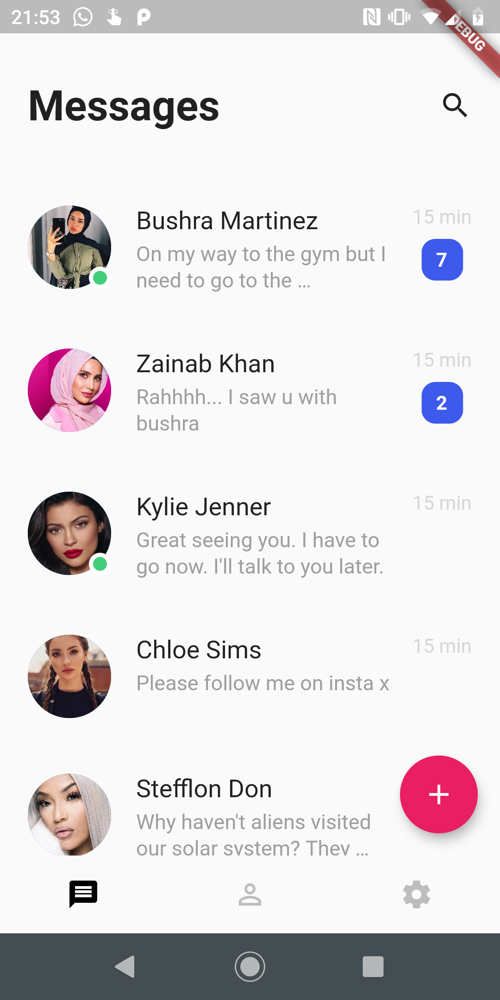
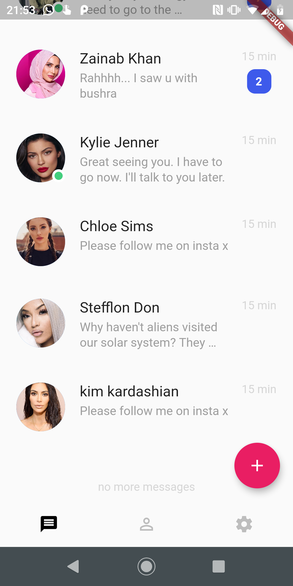
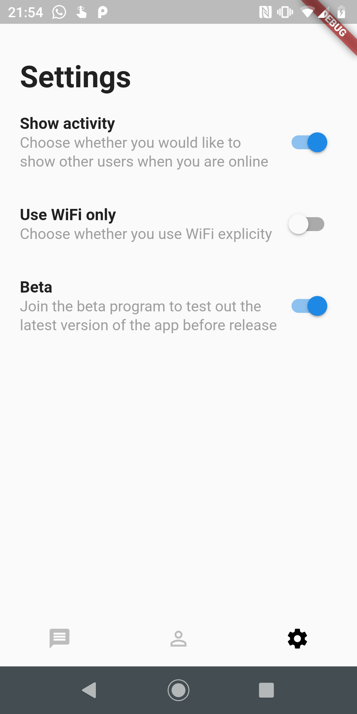
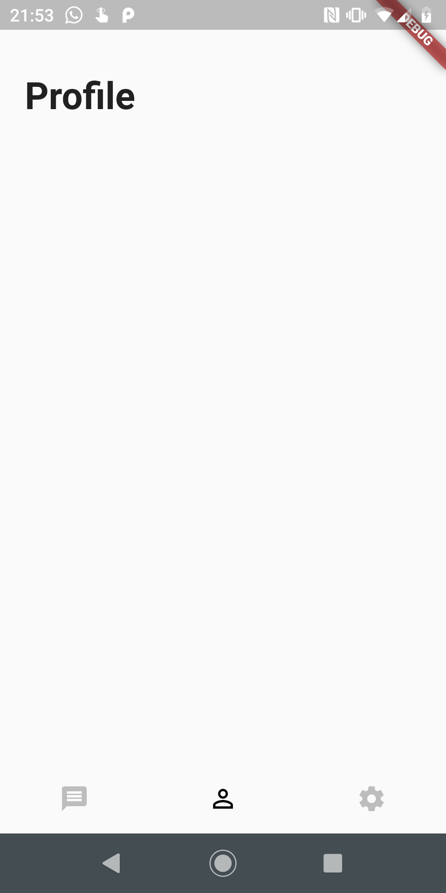

# flutter-one-day-build

I wanted to see if I could make a UI for a chat app using flutter on a summer day break. 

## Demo

Here is a demo of the project.

## Screenshots

Here are some screenshots of the app UI. I ran out of time and that's the reason why the profile section is a bit plain.

